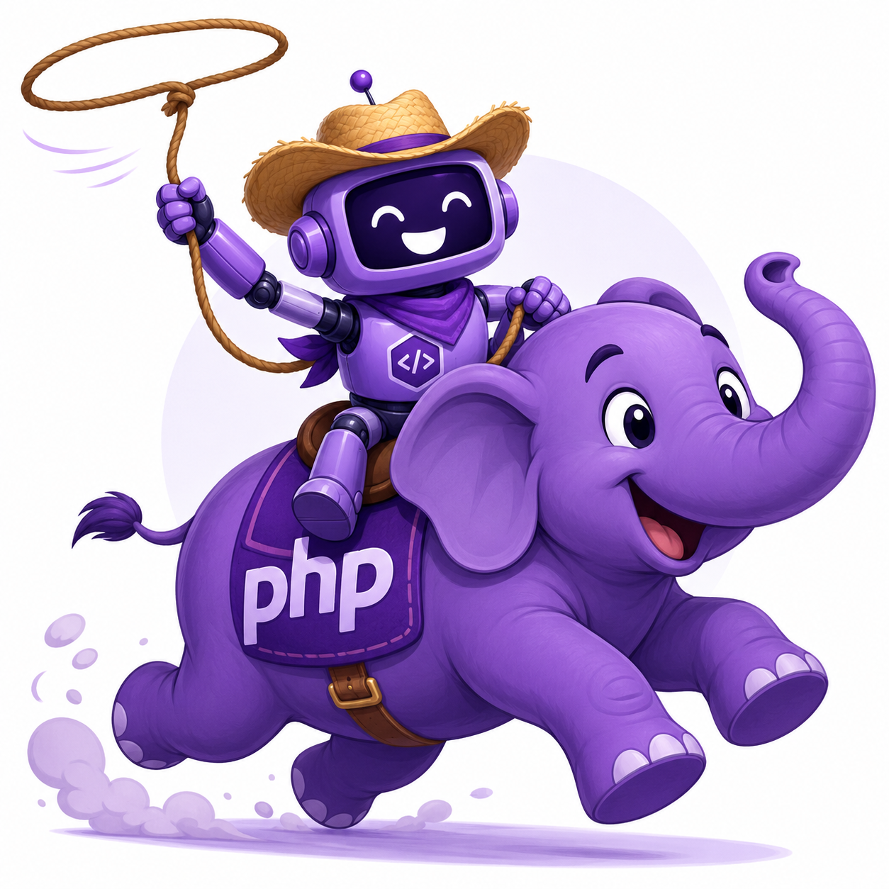

# Purple PHP



Purple PHP is an enterprise AI modernization SDK for existing PHP applications.

It is designed for teams with significant sunk cost in PHP-based CMS, ecommerce, admin, support, catalog, and workflow systems. The goal is to add secure, auditable AI behavior without rewriting the application estate.

## Current Shape

Purple PHP is Composer-first. Native runtime, sidecar, and PHP extension support may become important deployment modes later, but the developer-facing center of gravity is PHP.

The current SDK includes:

* Smart functions: typed, auditable AI calls for narrow repeatable tasks.
* Chat sessions: stateful assistant flows built on the same provider, policy, and audit contracts.
* Tool contracts: named tools with input/output schemas and side-effect levels.
* Looping agents: goal-driven runners that can call tools under limits, hooks, policy, audit, and approvals.
* Runtime hooks: extension points around provider requests, tool calls, and agent lifecycle events.
* CLI support: a `purple` command for demos, diagnostics, provider checks, and audit inspection.
* Enterprise workflow ports: CMS-agnostic content, catalog, order, support, approval, and audit adapters.

The first milestone was smart functions. The repository now carries the broader proof package so the early public API can be evaluated as a connected SDK, not only as isolated examples.

## Quick Start

```bash
composer install
php examples/smart-functions/sdk-quickstart.php
php examples/smart-functions/catalog-summary.php
php examples/chat/fake-chat.php
php examples/agents/catalog-agent.php
php bin/purple demo smart-function
```

The `Sdk` entry point bundles a provider, model, policy, audit log, and schema validator for common setup:

```php
use Purple\Sdk;
use Purple\Testing\FakeProvider;

$sdk = new Sdk(
    provider: FakeProvider::replying('{"summary":"Ready for catalog review."}'),
    providerName: 'fake',
    model: 'fake-model',
);

$summary = $sdk->smartFunction(
    name: 'catalog.summary',
    prompt: 'Summarize {{ title }} as JSON.',
    outputSchema: '{"type":"object","required":["summary"],"properties":{"summary":{"type":"string"}}}',
)->run(['title' => 'Merino travel cardigan']);
```

For named provider setup, use `ProviderProfile` factories:

```php
use Purple\ProviderProfile;
use Purple\Sdk;

$sdk = Sdk::openAI(
    profile: ProviderProfile::openAI(
        model: 'gpt-4.1-mini',
        secretName: 'OPENAI_API_KEY',
    ),
);
```

When installed as a Composer dependency, the CLI is exposed as:

```bash
vendor/bin/purple diagnostics
vendor/bin/purple audit inspect var/audit/catalog.jsonl
vendor/bin/purple provider check openai
```

## Provider Security

Provider credentials are resolved through `SecretResolver` implementations instead of being passed around as normal strings in application code. `EnvironmentSecretResolver` reads named environment variables, and `SecretValue` redacts itself when stringified.

The OpenAI profile defaults to `OPENAI_API_KEY`, and `.env.example` documents the expected local setup without including secret values.

```bash
cp .env.example .env
vendor/bin/purple provider check openai
```

Tests and local examples can use `FakeProvider` to avoid external provider calls.

## Enterprise Principles

Purple PHP treats existing PHP estates as valuable terrain.

The SDK should be:

* Composer-first
* provider-neutral
* secure by default
* auditable by default
* policy-driven
* CMS-agnostic
* ecommerce-aware
* optional-native, not native-required

Policy is enforcement. Hooks are extension points.

## Validation

```bash
composer check
```

The check script runs PHPUnit, PHPStan, and php-cs-fixer in dry-run mode.

## Planning Artifacts

The current project outline lives in [outline.md](outline.md).

The Spec Kitty mission package lives in [kitty-specs/001-purple-php-enterprise-ai-sdk](kitty-specs/001-purple-php-enterprise-ai-sdk/spec.md).
